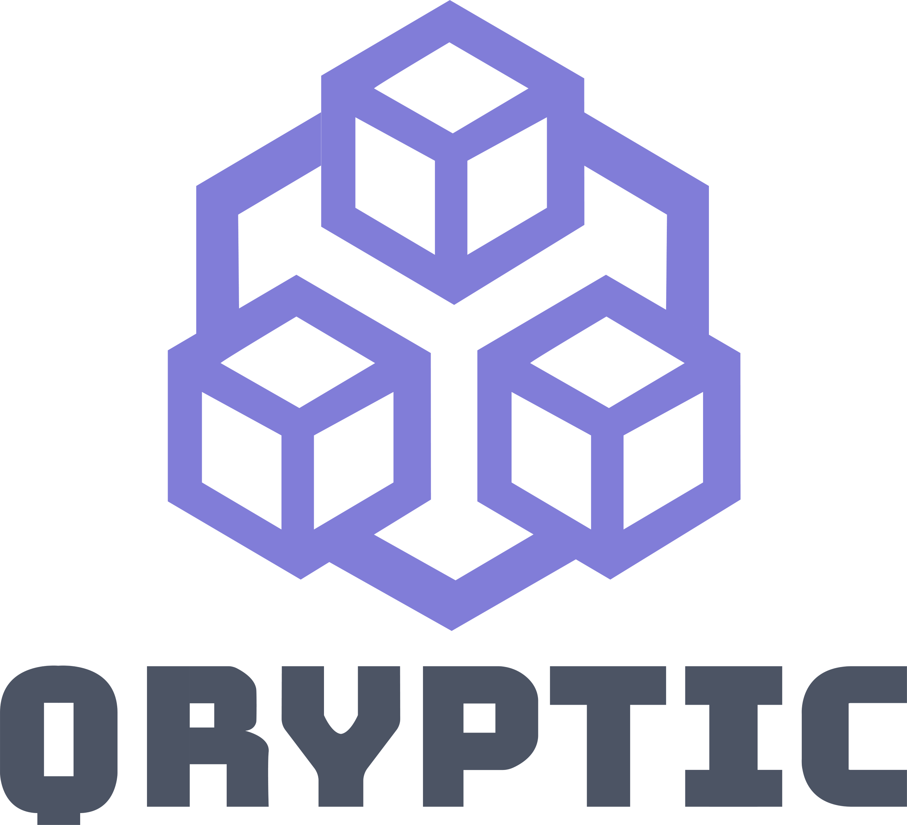

# Qryptic



Simple Blockchain written in C++. Currently just for learning purposes. 

## Setup and run

1. Clone the repository
2. Run `cmake .` to initialize CMake project
3. Run `cmake -B ./build -S .`
4. Go to build directory and run `make`
5. Run executable `./BlockchainCPP`

### Output

The output when running the application:

```
Mining block 1...
Block mined: 0000006ee9287cdbdf3db023f75184f8b4a03335e4616dce8115467c4a388c0b
Mining block 2...
Block mined: 0000008b49647809ec537284d4853152e49b7a1757a5b1af4449a89b5151fa4b
Mining block 3...
Block mined: 000000f0afe28da43bc218c23a5d6ecbbc3b7e7efa80db61c7bfc5302759256c
```

### Unit tests

To run the test cases in **blockchain_test.cpp** that comes along we need (after we have built) to run:

`./build/blockchain_test`

We need in the future to link all test files so we can run all unit tests at once.

### Clean 

If we want to do a cleanup of generated files during build we can run:

`git clean -xfd`

## Contribute

If you would like to contribute to this project there is two ways:

- Send a pull request
- Donate to our BTC/ETH address
- Join our Discord and discuss ideas

### Pull request

We appreciate all contributions whether it be small changes such as documentation of source code to major improvement of code. The easiest way is to make a fork and then make a pull request into our develop branch. To make the PR go through make sure to include this information:

```
What does this PR do?

Why are these changes required?

This PR has been tested using (e.g. Unit Tests, Manual Testing):

Extra details?
```

### Donate

BTC: bc1ql97dlhhexma7agkk7gmg76t7ljycuqc9xgr4vl

ETH: 0x03A049028B673Cc5EF676695f442eC5614877335

## Contributors


<!-- ALL-CONTRIBUTORS-LIST:START - Do not remove or modify this section -->
<!-- prettier-ignore-start -->
<!-- markdownlint-disable -->
<table>
  <tr>
    <td align="center"><a href="https://github.com/mjovanc"><br /><sub><b>Marcus Cvjeticanin</b></sub></a><br /></td>
  </tr>
</table>

<!-- markdownlint-enable -->
<!-- prettier-ignore-end -->
<!-- ALL-CONTRIBUTORS-LIST:END -->

## License

The license is GPL-3.0 License.
